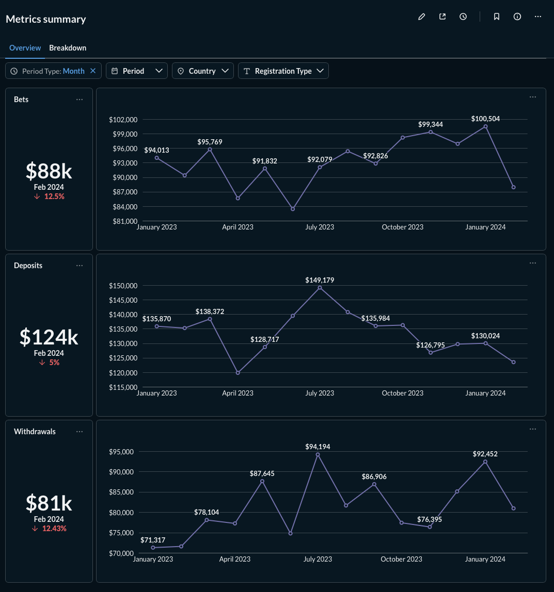
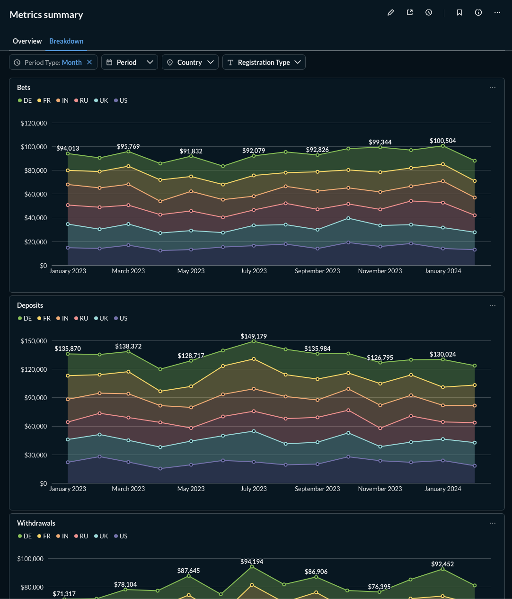

# Transaction Analytics Pipeline

End-to-end incremental transaction analytics pipeline built with Airflow, dbt, PostgreSQL, Docker, and Metabase.



## О проекте

Проект воспроизводит полный путь данных от файлового источника до аналитического дашборда. Пайплайн загружает данные об игроках и транзакциях, приводит суммы к USD по историческому курсу и формирует показатели депозитов, выводов и ставок во времени и в разрезе стран регистрации.

### Что реализовано

- воспроизводимое локальное окружение в Docker Compose;
- оркестрация загрузки и преобразований в Apache Airflow;
- параллельное выполнение независимых веток DAG;
- инкрементальная загрузка новых и изменившихся версий строк;
- инкрементальные dbt-модели со стратегией `delete+insert`;
- dimensional model по методологии Kimball;
- встроенные и кастомные dbt-тесты, включая сверку сумм между слоями;
- отчётный слой с дневной и месячной гранулярностью;
- интерактивный дашборд в Metabase;
- документация dbt и lineage-граф.

## Архитектура

```text
CSV → Airflow → PostgreSQL raw → dbt staging → dbt data_mart
    → dbt data_mart_report → Metabase
```

| Слой | Назначение |
|---|---|
| `raw` | Хранение полученных версий строк максимально близко к источнику |
| `staging` | Типизация, очистка и выбор последней версии бизнес-ключа |
| `data_mart` | Измерения, факты и дневные показатели игроков |
| `data_mart_report` | Готовые наборы данных для BI-отчётности |

Airflow DAG `metrics_overview` объединяет загрузку источников, построение dbt-моделей и тестирование данных. Независимые модели выполняются параллельно, а зависимости между слоями задаются явно.

## Модель данных

Слой `data_mart` построен как dimensional model и включает:

- измерения `dim_player`, `dim_provider`, `dim_game`;
- факты `fact_deposit`, `fact_withdrawal`, `fact_bet`;
- дневные показатели игроков `player_metrics`.

Слой `data_mart_report` содержит дневную таблицу `metrics_overview` и месячное представление `monthly_summary`.


Концептуальная модель, описание слоёв и детали проектирования находятся в [документации DWH](docs/dwh/README.md).

## Инкрементальная загрузка

При первом выполнении DAG источник загружается полностью. Последующие запуски:

- отбирают операции и валютные курсы внутри 30-дневного lookback-окна;
- перечитывают небольшие справочники целиком;
- добавляют в `raw` только новые и изменившиеся версии бизнес-ключей;
- сохраняют предыдущие версии строк;
- передают изменения дальше через техническое поле `loaded_at`;
- пересчитывают только затронутые записи и даты.

CSV-источник не предоставляет `created_at`, `updated_at`, `deleted_at` и информацию об удалениях. Поэтому принято бизнес-допущение: записи не изменяются позднее 30 дней после создания, а идентификаторы и бизнес-даты операций остаются неизменными.

Python физически просматривает CSV целиком, поскольку файл не поддерживает индексы и выборочное чтение. Инкрементальными являются запись в DWH и последующие преобразования. В промышленном файловом источнике эффективное извлечение строилось бы на датированных файлах, партициях или журнале обработанных объектов.

## Быстрый запуск

### Требования

- Git;
- запущенный Docker Desktop с Docker Compose.

### Развёртывание

```bash
git clone https://github.com/kulakovsemen27/airflow-dbt-pipeline.git
cd airflow-dbt-pipeline
cp .env.example .env
docker compose up --build -d
```

Локальный `.env` создаётся из `.env.example`. Настоящий `.env` исключён из Git и не передаётся вместе с проектом.

### Доступ к сервисам

| Сервис | Адрес | Credentials |
|---|---|---|
| Airflow | [http://localhost:8080](http://localhost:8080) | `AIRFLOW_ADMIN_USERNAME` / `AIRFLOW_ADMIN_PASSWORD` из `.env` |
| PostgreSQL | `localhost:5432` | `POSTGRES_DB`, `POSTGRES_USER`, `POSTGRES_PASSWORD` из `.env` |
| Metabase | [http://localhost:3000](http://localhost:3000) | первоначальная настройка при первом открытии |

Значения по умолчанию из `.env.example`:

```text
Airflow
login: airflow
password: airflow

PostgreSQL
host: localhost
port: 5432
database: postgres_db
user: postgres_user
password: postgres_password
```

## Запуск пайплайна

После запуска контейнеров:

1. Открыть Airflow и войти с credentials из `.env`.
2. Найти DAG `metrics_overview` и включить его, если он находится на паузе.
3. Запустить DAG вручную и дождаться успешного завершения всех задач.
4. При необходимости подключиться к PostgreSQL и проверить схемы и таблицы.
5. Посмотреть [документацию DWH](docs/dwh/README.md) и [дашборд Metabase](docs/metabase/README.md).

DAG настроен на ежемесячный запуск по расписанию `@monthly` и также поддерживает ручной запуск через Airflow.

## dbt Docs и lineage

После успешного выполнения DAG можно сгенерировать документацию dbt:

```bash
docker compose run --rm dbt docs generate
```

Затем запустить локальный сервер:

```bash
docker compose run --rm -p 127.0.0.1:8081:8081 dbt docs serve --host 0.0.0.0 --port 8081
```

Документация моделей, тестов, источников и lineage-граф будет доступна по адресу [http://localhost:8081](http://localhost:8081). Сервер работает в текущем терминале и останавливается сочетанием `Ctrl+C`.

## Дашборд

Metabase-отчёт содержит обзор динамики ключевых метрик и их детализацию по странам, типам регистрации и периоду.



Конфигурация дашборда хранится в локальном Docker volume и не включена в Git. На чистом окружении Metabase запускается без готовых карточек, но все данные для их построения полностью воспроизводятся пайплайном. Дополнительные скриншоты и описание находятся в [документации Metabase](docs/metabase/README.md).

## Структура репозитория

```text
airflow/          DAG и Python-код загрузки
dbt/              dbt-модели, тесты и конфигурация
docker/           Dockerfile и зависимости образов
docs/             документация, диаграммы и скриншоты
source_data/      исходные CSV-файлы
sql/ddl/          создание схем и raw-таблиц PostgreSQL
docker-compose.yml
```

## Остановка окружения

Остановить контейнеры, сохранив данные в Docker volumes:

```bash
docker compose down
```

Полностью удалить окружение вместе с данными PostgreSQL, метаданными Airflow и конфигурацией Metabase:

```bash
docker compose down -v
```

Команда с `-v` безвозвратно удаляет Docker volumes проекта. Локальные логи Airflow в каталоге `airflow/logs` сохраняются.
