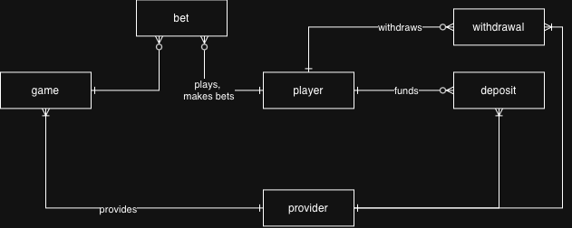

# Концептуальная модель DWH

Концептуальная модель описывает предметную область без привязки к базе данных, именам таблиц, типам данных и техническим ключам.

## Цель модели данных
Подготовить данные для ответа на два бизнес-вопроса:

1. Как меняются суммы депозитов, выводов и ставок по месяцам?
2. Как эти показатели распределены по странам регистрации игроков?

## Бизнес-процессы

| Бизнес-процесс | Событие | Grain | Мера |
|---|---|---|---|
| Депозит | Игрок вносит деньги | Одна операция депозита | Сумма депозита |
| Вывод | Игрок выводит деньги | Одна операция вывода | Сумма вывода |
| Ставка | Игрок совершает ставку в игре | Одна операция ставки | Сумма ставки |

Все суммы поступают в исходной валюте и должны быть пересчитаны в USD по курсу на дату операции.

## Основные сущности

- **Player** — совершает финансовые и игровые операции; страна и тип регистрации являются его характеристиками.
- **Deposit** — операция пополнения баланса.
- **Withdrawal** — операция вывода средств.
- **Bet** — игровая операция с денежной суммой.
- **Provider** — обслуживает финансовую или игровую операцию.
- **Game** — игра, в которой совершена ставка.

Дата и валюта являются характеристиками операций, а не самостоятельными сущностями DWH.

## Границы модели

- Страна и тип регистрации хранятся как неизменяемые характеристики игрока.
- Дата хранится непосредственно в операциях.
- Валюта хранится кодом непосредственно в операциях.
