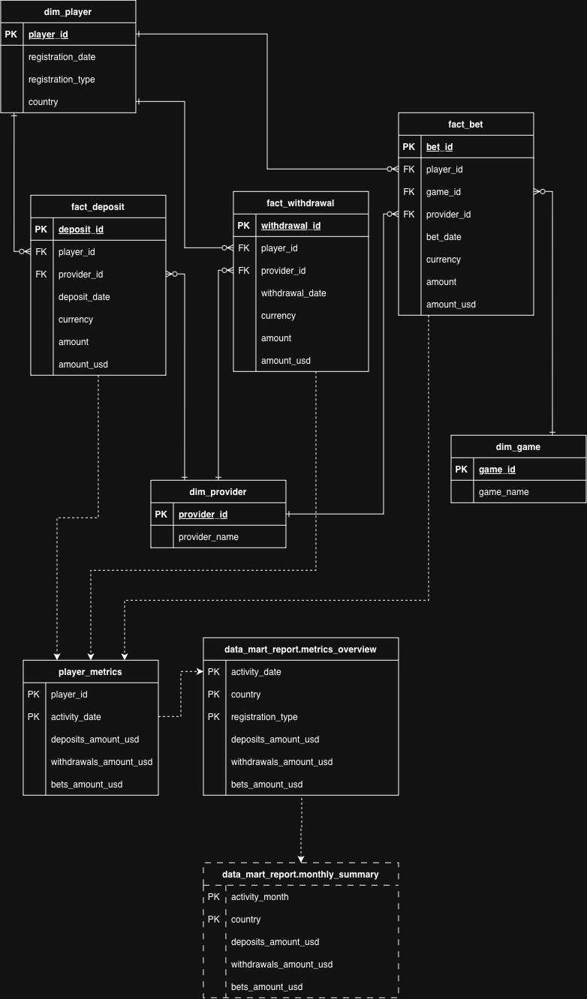
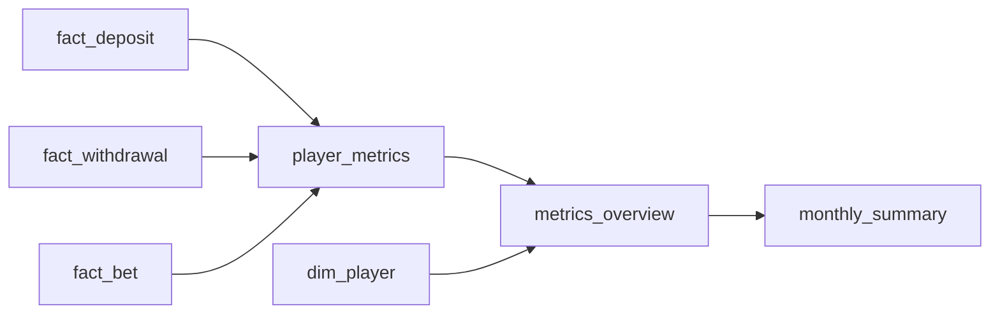

# Логическая модель DWH

Логическая модель переводит бизнес-сущности из концептуальной модели в размерную модель. Она описывает таблицы, атрибуты, grain и связи, но пока не определяет PostgreSQL-типы, индексы и способы физической загрузки.

## Слой `data_mart`

### Измерения

#### `data_mart.dim_player`

Grain: одна строка — один игрок.

| Атрибут | Роль | Источник |
|---|---|---|
| `player_id` | PK | `staging.players.player_id` |
| `registration_date` | Описательный атрибут | `staging.players.registration_date` |
| `registration_type` | Описательный атрибут | `staging.players.registration_type` |
| `country` | Описательный атрибут | `staging.players.country` |

#### `data_mart.dim_provider`

Grain: одна строка — один провайдер.

| Атрибут | Роль | Источник |
|---|---|---|
| `provider_id` | PK | `staging.providers_map.provider_id` |
| `provider_name` | Описательный атрибут | `staging.providers_map.provider_name` |

#### `data_mart.dim_game`

Grain: одна строка — одна игра.

| Атрибут | Роль | Источник |
|---|---|---|
| `game_id` | PK | `staging.games_map.game_id` |
| `game_name` | Описательный атрибут | `staging.games_map.game_name` |

### Факты

#### `data_mart.fact_deposit`

Grain: одна строка — один депозит.

| Атрибут | Роль | Источник или правило расчёта |
|---|---|---|
| `deposit_id` | PK | `staging.deposits.deposit_id` |
| `player_id` | FK на `dim_player` | `staging.deposits.player_id` |
| `provider_id` | FK на `dim_provider` | `staging.deposits.provider_id` |
| `deposit_date` | Дата операции | `staging.deposits.deposit_date` |
| `currency` | Код исходной валюты | `staging.deposits.currency` |
| `amount` | Исходная сумма | `staging.deposits.amount` |
| `amount_usd` | Сумма в USD | Исходная сумма, разделённая на курс валюты в день операции |

#### `data_mart.fact_withdrawal`

Grain: одна строка — один вывод.

| Атрибут | Роль | Источник или правило расчёта |
|---|---|---|
| `withdrawal_id` | PK | `staging.withdrawals.withdrawal_id` |
| `player_id` | FK на `dim_player` | `staging.withdrawals.player_id` |
| `provider_id` | FK на `dim_provider` | `staging.withdrawals.provider_id` |
| `withdrawal_date` | Дата операции | `staging.withdrawals.withdrawal_date` |
| `currency` | Код исходной валюты | `staging.withdrawals.currency` |
| `amount` | Исходная сумма | `staging.withdrawals.amount` |
| `amount_usd` | Сумма в USD | Исходная сумма, разделённая на курс валюты в день операции |

#### `data_mart.fact_bet`

Grain: одна строка — одна ставка.

| Атрибут | Роль | Источник или правило расчёта |
|---|---|---|
| `bet_id` | PK | `staging.games.bet_id` |
| `player_id` | FK на `dim_player` | `staging.games.player_id` |
| `game_id` | FK на `dim_game` | `staging.games.game_id` |
| `provider_id` | FK на `dim_provider` | `staging.games.provider_id` |
| `bet_date` | Дата операции | `staging.games.game_date` |
| `currency` | Код исходной валюты | `staging.games.currency` |
| `amount` | Исходная сумма ставки | `staging.games.amount` |
| `amount_usd` | Сумма в USD | Исходная сумма, разделённая на курс валюты в день операции |

Провайдер ставки определяется по самой операции `staging.games.provider_id`. Провайдер из `staging.games_map` не подставляется вместо него, поскольку расхождение между этими значениями считается аномалией источника.

### `data_mart.player_metrics`

Grain определяется составным PK: одна строка — один игрок за один календарный день.

| Атрибут | Роль | Правило расчёта |
|---|---|---|
| `player_id` | PK | `dim_player.player_id` |
| `activity_date` | PK | День совершения операций |
| `deposits_amount_usd` | Мера | Сумма депозитов игрока в USD за день |
| `withdrawals_amount_usd` | Мера | Сумма выводов игрока в USD за день |
| `bets_amount_usd` | Мера | Сумма ставок игрока в USD за день |

## Слой `data_mart_report`

Дневная отчётная таблица позволяет строить отчёты с разной временной гранулярностью. Отдельное месячное представление соответствует формату, указанному в задании.

### `data_mart_report.metrics_overview`

Grain определяется составным PK: одна строка — одна страна, один тип регистрации и один календарный день.

| Атрибут | Роль | Правило расчёта |
|---|---|---|
| `country` | PK | `dim_player.country` |
| `registration_type` | PK | `dim_player.registration_type` |
| `activity_date` | PK | День совершения операций |
| `deposits_amount_usd` | Мера | Сумма депозитов игроков сегмента в USD за день |
| `withdrawals_amount_usd` | Мера | Сумма выводов игроков сегмента в USD за день |
| `bets_amount_usd` | Мера | Сумма ставок игроков сегмента в USD за день |

`player_metrics` объединяет операции через `UNION ALL`, а затем агрегирует их до уровня игрока и дня. `metrics_overview` агрегирует показатели `player_metrics` по стране и типу регистрации. Прямое соединение трёх таблиц фактов не используется, поскольку оно размножает строки и искажает суммы.

### `data_mart_report.monthly_summary`

Grain: одна строка — одна страна и один календарный месяц.

| Атрибут | Роль | Правило расчёта |
|---|---|---|
| `activity_month` | PK | Первый день календарного месяца |
| `country` | PK | Страна регистрации игрока |
| `deposits_amount_usd` | Мера | Сумма депозитов страны в USD за месяц |
| `withdrawals_amount_usd` | Мера | Сумма выводов страны в USD за месяц |
| `bets_amount_usd` | Мера | Сумма ставок страны в USD за месяц |

`monthly_summary` является представлением над `metrics_overview`. Дневные данные сохраняются в основной витрине, а месячная агрегация предоставляется в требуемом заданием формате.

### Зависимости отчётных таблиц

